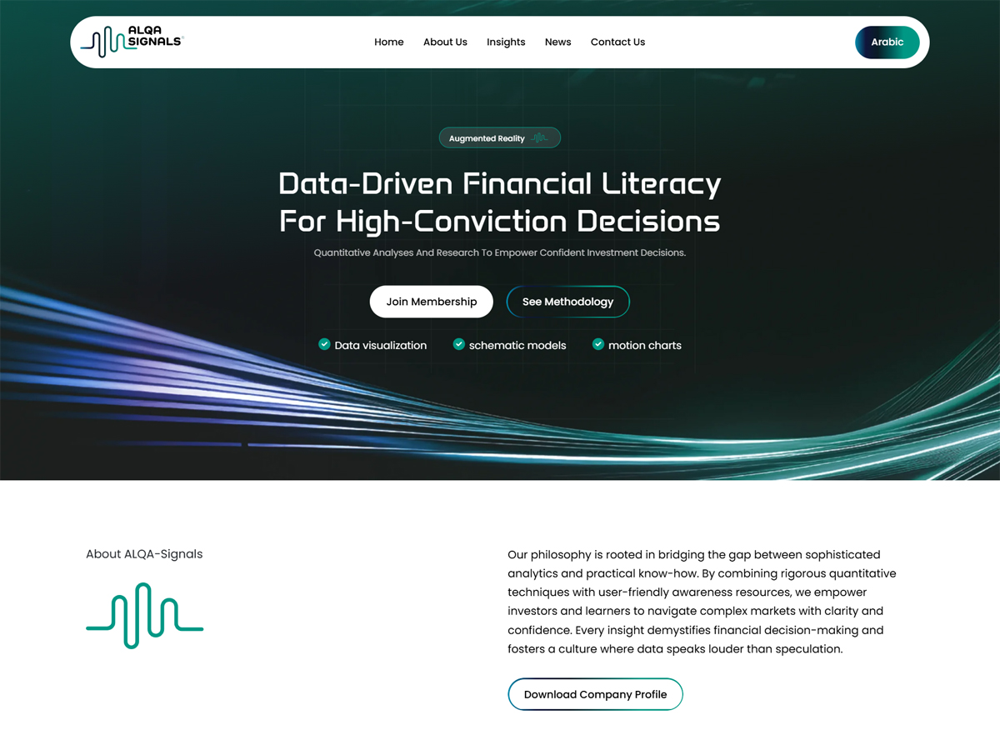

# Alqa Signals - Custom WP Theme & Elementor Widgets

A fully custom **WordPress theme** built alongside **custom Elementor widgets** that allow the client to edit all content and visuals **without touching any code**.

This project received a **5-star rating** from *Mohammed* under the review titled:  
**“Converting an HTML Design to WordPress + Elementor Widgets.”**

---

## 📌 Project Overview

The client requested a complete conversion of a pre-designed **HTML layout** into a fully functional **WordPress website**, with the ability to customize:

- Text & content  
- Layout & styling  
- Buttons, links, and UI elements  

To achieve this, I developed **custom Elementor widgets**—one for each major section of the original design—allowing full visual and structural flexibility through the Elementor interface.

---

## 📄 Pages Included

The theme includes all standard and essential site pages:

- Homepage  
- About Us  
- Contact Us  
- Privacy Policy  
- Terms of Use  
- Blog Archive & Single Blog Pages  

Demo posts relevant to the website’s niche were also added to showcase how articles appear in the final design.

---

## ⚙️ Installed & Configured Plugins

A curated list of essential plugins was installed to improve functionality, performance, and usability:

- **Elementor** – Page builder + custom widgets  
- **Classic Editor** – Editor stability  
- **LiteSpeed Cache** – Performance optimization & caching  
- **Contact Form 7** – Contact form integration  
- **TranslatePress** – Multilingual support  

---

## 🧩 Key Features

- Fully custom WordPress theme  
- Custom Elementor widgets for each design section  
- Clean, modular code structure  
- Responsive design across all devices  
- SEO-friendly architecture  
- High performance with caching optimization  
- Multilingual-ready structure  
- Developer-friendly file organization  

---

## 🚀 Tech Stack

- **WordPress**
- **PHP**
- **HTML / CSS / JavaScript**
- **Elementor Framework**
- **LiteSpeed Server Optimization**

---

## 💬 Feedback & Support

I’m always happy to help or answer questions about this project.  
Feel free to reach out with any inquiries or collaboration requests!
